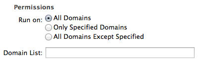

# NoPreload
A Safari extension to prevent webpages from preloading HTML 5 audio content. You can download the latest version from the [releases page][download].

## About

NoPreload was created in the spirit of minimizing excess bandwidth usage. As a fan of podcasts, I'm often checking show notes and the like for an episode, only to find that the 40+ MB file starts downloading automatically, when all I wanted was to find a link to something. Unfortunately some sites use audio player libraries that pre-load the audio files, rather than waiting for the user to click play. This extension fixes that — the audio player remains, but it only starts the download once you click play.

## Instructions
[Download][] the extension file and open it to install it in Safari. No further configuration is necessary, but if desired, it is possible to set a whitelist or blacklist of sites to control which domains NoPreload runs on. This is accessible from Safari's Extensions Preferences.

If you want to only block preloading on certain domains (whitelisting), select the **Only Specified Domains** option, and enter the domains you want into the **Domain List** field. Similarly, if you want to block preloading on all domains except ones you specify (blacklisting), select the **All Domains Except Specified** option, and enter your blacklisted domains in the **Domain List** field.

Domains should be separated by commas, with no leading `http://` or `https://`, nor any trailing backslash. Domains will match all subdomains, so `example.com` will match `example.com` and `www.example.com`, whereas `www.example.com` matches `www.example.com` but not `example.com` or `blog.example.com`.

## Technical Details
NoPreload works by setting the `preload` attribute on any HTML `<audio>` element to `none`. It launches after all the initial page load scripts have fired, so it should work with most dynamically inserted players, but not those created on user actions.

## Known Issues
- NoPreload only works on players that make use of the HTML `<audio>` element. This means that it will not block Flash or other plugins, nor is it likely to in the future. For this sort of thing, you should check out the very useful [ClickToPlugin][] extension.

## Version History
- 1.0.0: Initial release.
- 1.0.1: Enabled NoPreload for pages served via HTTPS (such as [Overcast][]'s web player).

[download]: https://github.com/robmathers/NoPreload/releases
[ClickToPlugin]: http://hoyois.github.io/safariextensions/clicktoplugin/
[Overcast]: https://overcast.fm
